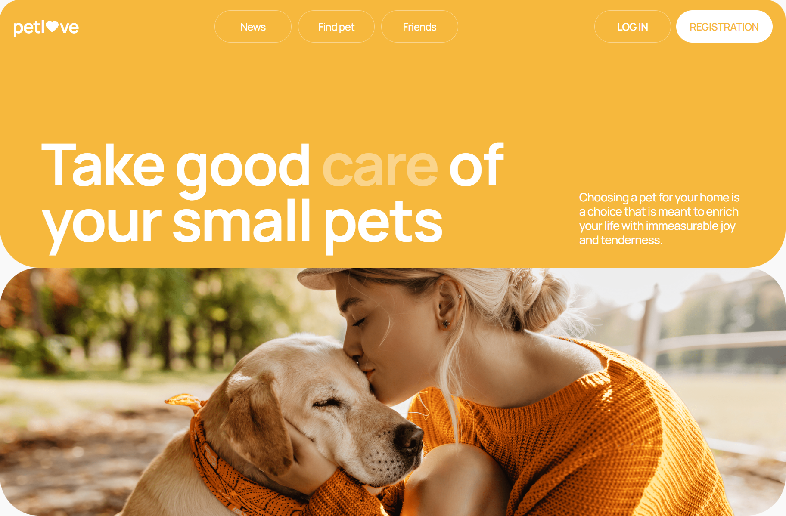

 <h1>Pet Love</h1>

<h2>The website for pet lovers.</h2>
 

 <h1>About project:</h1>
 <h2><a href="https://www.figma.com/file/puMNfZVg4YI8UZoJ1QiLLi/Petl%F0%9F%92%9Bve?type=design&node-id=55838-750&mode=design&t=Xg1IwIcKebTl5xGs-0">Layout</a></h2>
 <h2><a href="https://docs.google.com/spreadsheets/d/1DmQUeGZy_oaXN6yn69ORLzou1ZQRyTMlrAqPSit_clw/edit?gid=1134921873#gid=1134921873">Technical task</a></h2>
  <h2><a href="https://petlove.b.goit.study/api-docs/#/">API documentation</a></h2>
<h3>For unauthorized users:</h3>
<ul><li>Possibility of login and registration; </li>
<li>Possibility to view the lists of news, pets and friends;</li>
<li>Possibility to filter pets list with pagination.</li>
<h3>For authorized users as bonus:</h3>
<ul><li>Possibility to add a pet to your favorites; </li>
<li>Possibility to create own pets;</li>
<li>Possibility to edit personal information.</li>
</ul>
 <h1>Used technologies:</h1>
 

 &nbsp;
   &nbsp;
  &nbsp;
  &nbsp;
  &nbsp;
    &nbsp;
        &nbsp;
        &nbsp;
         &nbsp;
         &nbsp;
  

